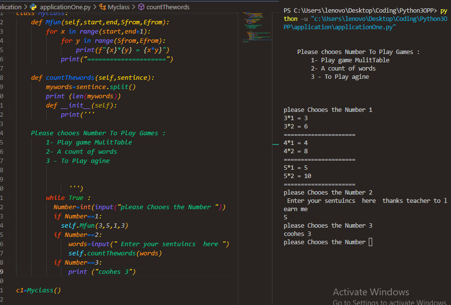
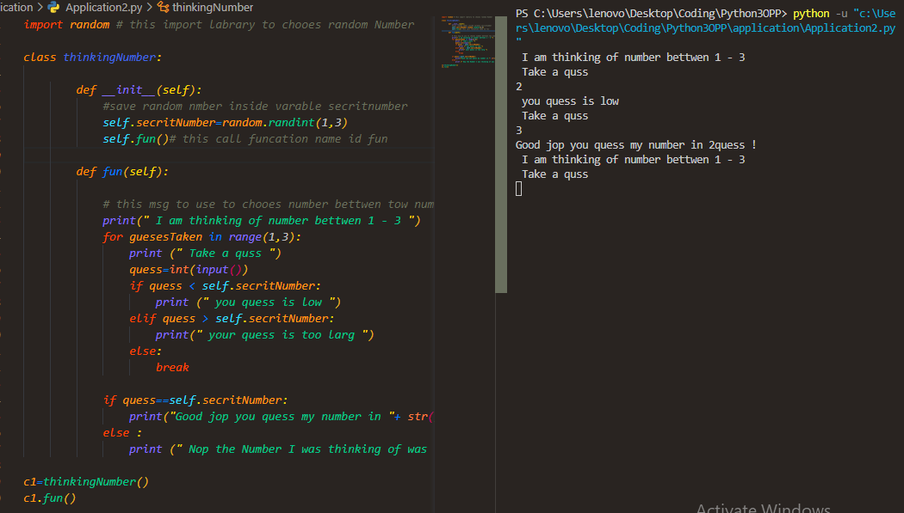

### ** this image about  code and result  file number OOP10
### ** here many skills  benifts  is 
+ ** use the file python syntix 
+ ** save file and open it 
+** write the code  clear 
+ ** use Class and Fuction 

this screenshot about how use this code 

### ** this full application  about use  tow gams 
+ play chooes  Number to  make table 
+ count of words 
+ 

### this my video chanel on youtube  you can see more about this 

### this screenshot for quess Number or thinking 
## i use many things for this application like :- 
+ Class and Function 
+ for loop 
+ if statment 
+ def function initilaze
+ input and tranfer to int  
  

###visit my website  

https://obeid.pro
